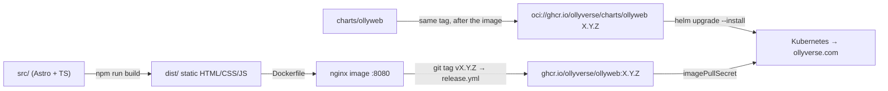
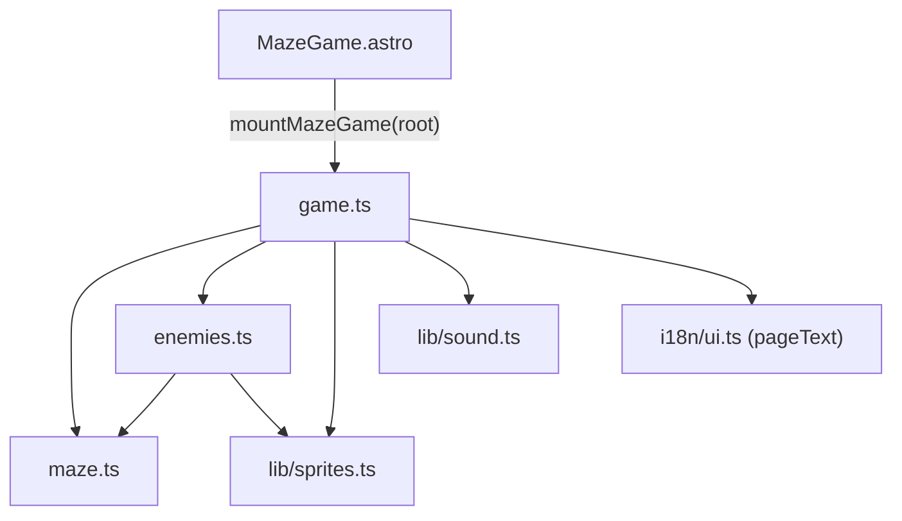

# Architecture

## Big picture



- **Astro** renders every page to static HTML at build time. There is no server code and no API.
- The only JavaScript in the browser is small component scripts (starfield, header, hero Olly) and the game.
- The runtime is **nginx** serving files. Anything that can serve a folder can host `dist/`.

## Source layout

```
src/
  pages/            index.astro (en, "/"), sk/index.astro ("/sk/") → both render HomePage
  layouts/Base.astro <head>, meta + hreflang, first-visit language redirect, starfield/header/footer
  components/       HomePage (composition), Hero, MazeGame, FieldGuide, SiteHeader, SiteFooter, Starfield
  i18n/ui.ts        all copy per language + helpers useText() (server) / pageText() (browser)
  game/             maze.ts, enemies.ts, game.ts, content.ts (planet names helper)
  lib/              sprites.ts, sound.ts, storage.ts
  styles/global.css colour tokens, fluid root font size, shared classes
public/             favicon
deploy/nginx.conf   runtime web server config
charts/ollyweb/     Helm chart (released to oci://ghcr.io/ollyverse/charts)
```

## Pages and languages

- `astro.config.mjs` enables Astro i18n: `en` is the default locale at `/`, `sk` lives at `/sk/`.
- Components read their strings with `useText(Astro.currentLocale)`; client scripts use `pageText()`, which
  picks the dictionary from `<html lang>`. Both languages are bundled into the (small) client JS.
- `Base.astro` emits `hreflang` alternates and, on the English home page only, an inline script that sends a
  first-time Slovak/Czech browser to `/sk/` unless `olly.lang` is already stored (the header switcher sets it).

## Layout and styling

- Everything is sized in `rem`; `html { font-size: clamp(16px, 0.65vw + 8px, 44px) }` makes the whole page
  scale from phones to 4K.
- On screens ≥ 1100 px the hero and the game sit side by side (`HomePage.astro`); below that they stack.
- The game cabinet caps its width by the viewport height so HUD + maze + controls fit one screen.
  Phones in landscape switch to "maze left, controls right".
- Colours are tokens in `global.css` (`--pink`, `--lilac`, `--mint`, `--butter`, …). Component styles are
  scoped; HTML injected with `innerHTML`/`set:html` is styled through `:global(...)`.

## The game (`src/game`)



- **`maze.ts`** — pure functions. A maze is a `Uint8Array` block grid of size `2·cells+1` (1 = wall).
  `generateMaze` is an iterative recursive backtracker plus random wall removal ("loopiness") so there are
  escape routes. `bfs`, `distances` and `pathBetween` do the pathfinding.
- **`enemies.ts`** — enemy kinds (`KINDS`: speed per level, wander chance, ghost flag, sprite frames),
  `roster(level)` (who appears where), and `moveEnemy` (grid walkers step to the neighbour closest to Olly
  using a distance field; ghosts float straight at him).
- **`game.ts`** — `mountMazeGame(root)` finds its DOM via `data-ref` attributes and runs one
  `requestAnimationFrame` loop: `update(dt)` then `render(now)`.
  - State machine: `title → play → win → play …` or `play → over → play`.
  - Olly moves cell to cell with an eased interpolation (`fx,fy → x,y`, `t` 0→1).
  - Input: keyboard sets `held` (walk while held); touch/pad set `queued`/`run` (Pac-Man style: keep running,
    take the queued turn at the first opening); tap on the maze barks.
  - A distance field from Olly's cell (`chase`) is recomputed whenever he commits to a new cell; all grid
    enemies read it, so chasing costs one BFS per Olly step, not per enemy per frame.
  - The canvas is sized to its box × `devicePixelRatio` (max 2) and redrawn every frame.
- **Sprites** (`lib/sprites.ts`) are rows of characters mapped through a palette; `drawPixels` draws them with
  an optional white sticker outline and mirrors them for `flip`.
- **Persistence**: `localStorage` via `store` — `olly.bones`, `olly.bestPlanet`, `olly.best.<planet>`,
  `olly.muted`, `olly.lang`. Losing it only resets scores.

## Container

- `Dockerfile`: stage 1 `node:22-alpine` runs `npm ci && npm run build` on the build platform (output is
  platform independent); stage 2 `nginxinc/nginx-unprivileged:1.30-alpine` copies `dist/`.
- Runs as non-root (uid 101), listens on **8080**, has a `HEALTHCHECK`.
- `deploy/nginx.conf`: `try_files $uri $uri/ $uri.html =404`, relative redirects (`/sk` → `/sk/` without the
  internal port), `expires max` for hashed `/_astro/*` assets, gzip, a few security headers, no server tokens.
- Images are multi-arch (`linux/amd64`, `linux/arm64`). See [release.md](release.md) for how they are published.

## Kubernetes

`charts/ollyweb` is a small Helm chart (Deployment, Service, optional Ingress, PodDisruptionBudget) with a
locked-down pod: non-root, read-only root filesystem with an `emptyDir` for nginx's `/tmp`, no capabilities,
no service-account token. It is released as an OCI artifact with the same version as the image.
Details: [kubernetes.md](kubernetes.md).
